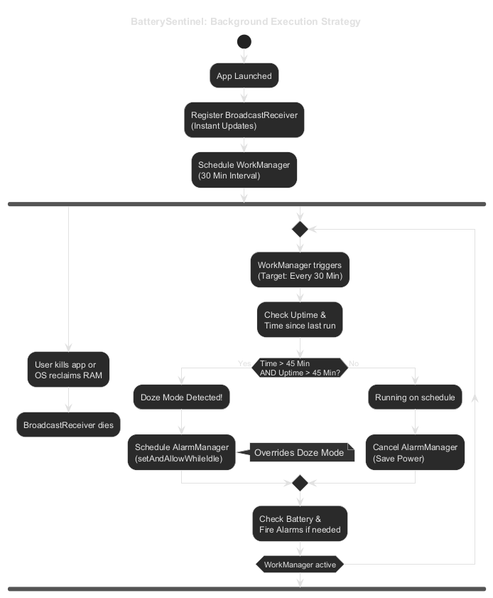
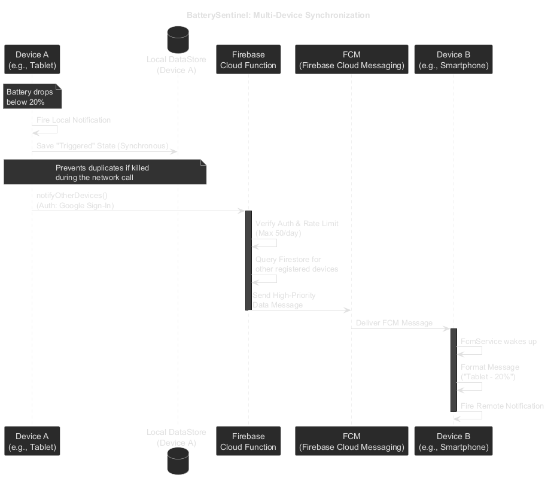

# BatterySentinel Architektur

BatterySentinel wurde entwickelt, um ein grundlegendes Android-Problem zu lösen: Wie überwacht man zuverlässig den Akkustand im Hintergrund, ohne dabei selbst den Akku leerzusaugen?

## 1. Strategie für die Hintergrundausführung

Moderne Android-Versionen beenden Hintergrundprozesse aggressiv, um Akku zu sparen (besonders bei Herstellern wie Samsung, Xiaomi etc.). BatterySentinel nutzt eine dreistufige Verteidigungsarchitektur, um sicherzustellen, dass Alarme immer zuverlässig ausgelöst werden.

### Stufe 1: Dynamischer Broadcast Receiver (Sofort)
Solange der App-Prozess im Arbeitsspeicher liegt, lauscht ein dynamischer `BroadcastReceiver` auf `ACTION_BATTERY_CHANGED`. Dieser Intent wird vom Android-Betriebssystem bei jeder Prozentänderung sofort ausgelöst.
- **Vorteile:** Sofortige Reaktion, praktisch null Stromverbrauch (das OS sendet den Broadcast ohnehin).
- **Nachteile:** Wenn das OS den App-Prozess beendet, um RAM freizugeben, stirbt auch der Receiver.

### Stufe 2: WorkManager Sicherheitsnetz (30 Min)
Um Prozess-Kills entgegenzuwirken, läuft alle 30 Minuten ein `PeriodicWorkRequest`. Dieser weckt die App, liest den aktuellen Akkustand direkt aus (über einen Null-Receiver für den Sticky-Intent) und gleicht ihn mit den Alarmen ab.
- **Vorteile:** Überlebt App-Neustarts und Prozess-Kills. Wird sicher von Androids Job-Scheduler verwaltet.
- **Nachteile:** Feuert nur alle 30 Minuten. Anfällig für den "Doze-Modus" (Tiefschlaf) von Android, der Hintergrundarbeiten auf inaktiven Geräten (z. B. ein Tablet, das auf dem Tisch liegt) um Stunden verzögern kann.

### Stufe 3: Adaptive Doze-Erkennung & AlarmManager (Doze-Override)
Wenn das Gerät in den tiefen Doze-Modus wechselt, können WorkManager-Läufe stark verzögert werden. Der `BatteryWorker` von BatterySentinel enthält eine intelligente **Adaptive Doze-Erkennung**:
- Der Worker vergleicht die Zeit seit seinem letzten Lauf. Überschreitet die Lücke 45 Minuten, erkennt er, dass der Doze-Modus ihn blockiert.
- Um Fehlalarme nach einem Geräteneustart (Gerät war ausgeschaltet) zu vermeiden, wird auch die Systemlaufzeit (Uptime) überprüft.
- Wird Doze erkannt, aktiviert er den `AlarmManager` mit der Funktion `setAndAllowWhileIdle()`. Diese spezifische API durchbricht den Doze-Modus.
- Der `AlarmReceiver` feuert nun zuverlässig im Tiefschlaf alle 30 Minuten, prüft den Akku und plant sich selbst neu.
- Sobald der Worker wieder pünktlich läuft (Gerät wurde aufgeweckt, Doze beendet), wird der AlarmManager automatisch deaktiviert, um wieder maximal Strom zu sparen.

## 2. Multi-Device Synchronisation

BatterySentinel kann Akkuwarnungen an andere Geräte senden (z. B. warnt das Tablet das Smartphone bei 20%).

### Datenfluss
1. **Lokaler Trigger:** Die lokale Architektur (Stufen 1-3) erkennt einen Schwellenwert und löst sofort eine lokale Benachrichtigung aus.
2. **Statussicherung:** Der "Ausgelöst"-Status wird synchron im `DataStore` gespeichert. Dies verhindert doppelte Warnungen, falls der Prozess während des anschließenden Netzwerkaufrufs vom System beendet wird.
3. **Cloud Function:** Eine Firebase Cloud Function (`notifyOtherDevices`) wird aufgerufen. Zur Authentifizierung wird der sichere Google-Login verwendet.
4. **Push-Benachrichtigung:** Die Cloud Function routet eine hochpriorisierte FCM (Firebase Cloud Messaging) Daten-Nachricht sicher an alle anderen registrierten Geräte desselben Nutzers.
5. **Empfang:** Der `FcmService` auf den empfangenden Geräten wacht auf, formatiert die Nachricht und zeigt eine lokale Benachrichtigung an, welches Gerät wenig Akku hat.

### Datenschutz & Infrastruktur
- Es werden ausschließlich der Gerätename, der aktuelle Akkustand und die benutzerdefinierte Nachricht übertragen.
- Die Authentifizierung läuft komplett sicher über Google (keine eigenen Passwörter erforderlich).
- **Vorkompilierte Version:** Bei Verwendung der von uns vorkompilierten APK aus den offiziellen Releases, werden für alle Firebase Cloud Functions und Firestore-Datenbanken **ausschließlich Server innerhalb der Europäischen Union (EU)** verwendet, um strengste Datenschutzstandards zu gewährleisten.

## 3. Diagnose-Logging System

BatterySentinel verfügt über ein integriertes, persistentes Text-Logging-System (`events.log`), um Transparenz in das Hintergrundverhalten zu bringen, ohne signifikant Strom zu verbrauchen.
- **Append-Only Betrieb:** Der `EventLogger` schreibt Logs in den lokalen App-Speicher und verwendet dafür einen IO Coroutine-Dispatcher, um den Main-Thread niemals zu blockieren.
- **Auto-Wartung:** Der Logger begrenzt das Log kontinuierlich auf 1000 Einträge (ältere Einträge werden über einen robusten FIFO-Ansatz verworfen), um sicherzustellen, dass der Speicher- und RAM-Bedarf über die Zeit komplett vernachlässigbar bleibt.
- **Korruptions-Resilienz:** Falls das Dateisystem durch Schreibsperren oder unerwartete Schäden blockiert wird (was normales Parsing verhindert), erkennt der Logger dies. Er bereinigt betroffene Zeilen proaktiv oder erstellt die Datei ganz neu, um absolute Stabilität zu garantieren.
